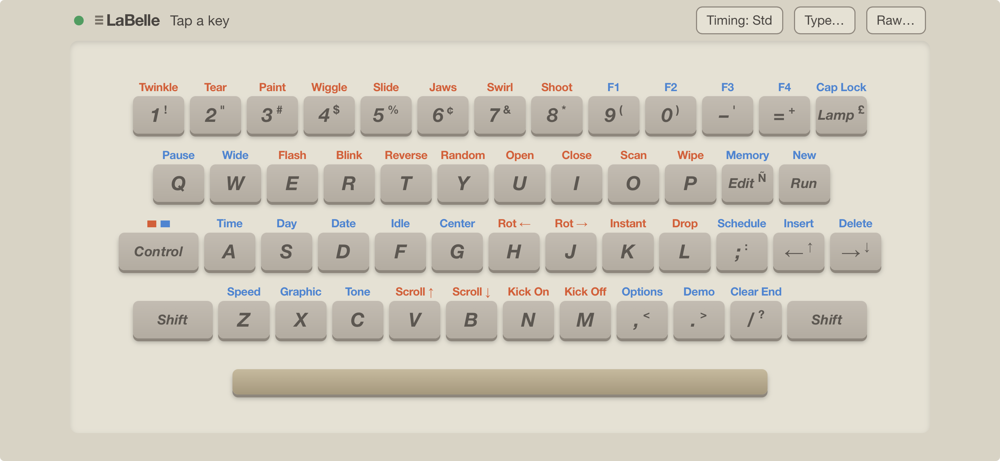
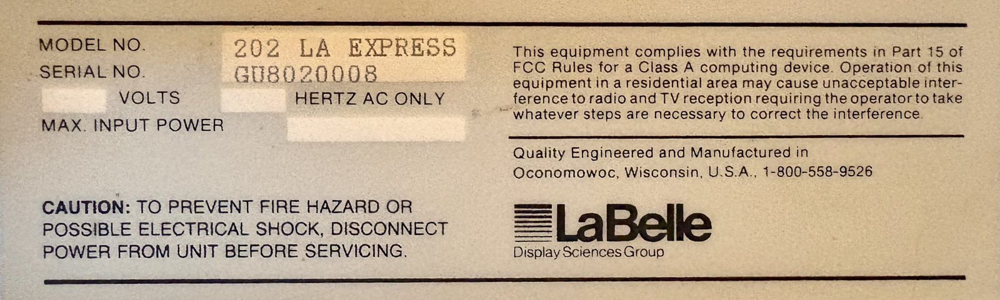

# labelle-ir

Infrared control for the **LaBelle 202 LA Express** LED message sign, using a
Global Caché iTach IP2IR. The sign's original IR keyboard is often lost. This
project reproduces that keyboard's IR codes, so the sign can be programmed and
run from a phone, a script, or any controller that can send IR (AMX, Crestron,
Pronto-hex blasters).



*The web keyboard on an iPhone, laid out like the original LaBelle IR
keyboard. The red and blue legends above the keys are the Control functions.*

It includes:

- **`labelle_web.py`**: a web keyboard that copies the LaBelle IR keyboard.
  Add it to an iPhone home screen and use it in landscape.
- **`labelle_gc.py`**: a command-line sender with key-by-name, text typing,
  raw codes, code scanning and Pronto-hex output.
- **`codes/labelle-202-rc5.csv`**: all 144 key codes, with Pronto hex.
- **[`docs/OPERATING.md`](docs/OPERATING.md)**: how to program and run the
  sign from the keyboard, with worked examples.

---

## Target equipment

| | |
|---|---|
| **Sign** | **LaBelle 202 LA Express** LED programmable message display, made by LaBelle Industries (**LaBelle Display Sciences Group**), Oconomowoc, Wisconsin |
| **Firmware** | **V5.0** (the only version tested) |
| **Original remote** | LaBelle IR keyboard: 48 keys plus **Control** and **Shift**, 9 V battery, quick-reference instructions on the underside |



*The rating label on the sign documented here. The volts, hertz and input
power fields were left blank at the factory.*

The sign has a small IR receiver window behind the red display lens. The
original keyboard sends to it from up to about 30 ft away.

Other LaBelle signs of the same era (the INFO 152 family, for example) use a
very similar command set. Wired-keyboard models may not have an IR receiver,
and other firmware versions haven't been tested.

### Power supply

The sign described here came **without its power supply**, and its original
input voltage and current rating aren't known. Most units found secondhand
are likely in the same position.

- **Original supply:** the rating label reads **"___ VOLTS ___ HERTZ AC
  ONLY"**, but the voltage, frequency and maximum input power were never
  filled in. There's also a **bridge rectifier directly behind the power
  jack**. Both point to a low-voltage **AC** wall transformer, and the INFO
  152 manual for a sister model describes a plug-in "power transformer" as
  well.
- **DC works too:** despite the "AC only" label, the rectifier means a DC
  supply of either polarity also works. Expect about 1.4 V to be lost across
  the rectifier.
- **Tested:** a **12 VDC, 2 A switch-mode supply** runs the sign normally, but
  the supply runs hotter than is comfortable. The load is plausibly around
  2 A, since the sign has a full LED matrix plus 1980s logic that's probably
  5 V.
- **Recommended:** a **12 VDC supply rated 4 A or more**. That's double the
  tested supply's rating, and 5 A gives extra margin. A regulated
  switch-mode supply from a reputable maker is the sensible choice.

Cautions:

- **Don't go above 12 V without checking inside.** The input rating is
  unknown. The internal 5 V regulator is probably a linear type, which turns
  every extra volt into heat. Check how hot the regulator gets on first
  power-up and after an hour of running.
- **Check the plug.** Before connecting a new supply, confirm the plug fits
  the sign's jack securely.
- **Low-voltage supplies only.** Never connect mains voltage to the sign's
  power jack.

### Memory backup battery

The sign has an internal battery that keeps the stored messages, and
probably the clock and calendar, when power is off.

On the unit documented here, which was in near-new condition, the battery had
**only one of its two pins soldered to the board**. The other was loose. It
may once have had an insulator fitted, with the intention that the seller
solder it at the point of sale; that's a guess. Either way, with an unsoldered
battery the sign **won't keep its messages or the time** when it's
unplugged.

If you have one of these signs:

- **If messages or the time disappear after a power cut,** open the sign and
  check that both battery pins are soldered.
- **Replace the battery.** These units are decades old, so the original
  battery is almost certainly worn out, whether or not it was ever
  connected. Fit a replacement with the same voltage and chemistry as the
  original (check what's printed on it).
- **Look for leakage.** Old rechargeable backup batteries often leak and
  corrode the board around them. If there's any sign of leakage, remove the
  battery and clean the area.

## Control hardware

| | |
|---|---|
| **IR gateway** | Global Caché **iTach IP2IR** (Ethernet to 3 IR ports). Tested on firmware `710-1005-05`. |
| **Emitter** | The adhesive-backed IR emitter supplied with the IP2IR, plugged into **IR port 1** |
| **Port mode** | `IR` (emitter), the factory default. Check with `labelle_gc.py cmd get_IR,1:1` |
| **Host** | Any machine on the same LAN that runs Python 3.9+. Only the standard library is used. |

> The IP2IR speaks Global Caché's **TCP API on port 4998** (`sendir,…`).
> It does **not** answer the newer REST API (`/api/host/...`) documented for
> Global Connect and Flex units.

### Emitter placement on the 202 LA Express

On the 202 LA Express, the **centre of the IR receiver window** is:

- **13" from the left edge** of the sign, and
- **about 5/8" below the top edge of the visible display area**.

Stick the adhesive emitter directly over that point, on the front lens. An
emitter is a short-range device that has to sit on the window, so a
millimetre-accurate position isn't needed, but it must cover the window.

```
 left edge of sign
 |<──────────── 13" ────────────>|
 ┌─────────────────────────────────────────────────────────────────────────┐
 │                                ◉  ← emitter, centred ~5/8" below the    │
 │                                     top edge of the visible display     │
 │                                                                         │
 │                        (visible LED display area)                       │
 └─────────────────────────────────────────────────────────────────────────┘
```

A Global Caché IR blaster (long-range) aimed at the sign should also work,
but hasn't been tested.

---

## Quick start

```bash
git clone <this repo> && cd labelle-ir

# Check that the iTach answers, and send a key
./labelle_gc.py --host 192.168.1.187 cmd getversion
./labelle_gc.py --host 192.168.1.187 send run      # the sign shows "Run M??"
./labelle_gc.py --host 192.168.1.187 send 0 1      # ...and runs memory 01
```

`--host` defaults to `192.168.1.187` and `--port` (the IR port) to `1`.
Change the defaults at the top of `labelle_gc.py`, or pass them on each run.

### Web keyboard (phone)

```bash
./labelle_web.py --host 192.168.1.187          # serves http://0.0.0.0:8765/
```

The app is designed for iPhone landscape; other phones and tablets work as
well.

**To install it on an iPhone as a home-screen app:**

1. Open **Safari** and go to `http://<computer-ip>:8765/`.
2. Tap **Share**, then **Add to Home Screen**.
3. Turn on **Open as Web App**.
4. Tap **Add**.

The **LaBelle** icon then opens the keyboard full-screen, without Safari's
toolbars. Turn the phone sideways to use it. This was confirmed from Safari;
use Safari rather than another browser for this step.

- **Keys:** laid out like the real keyboard. The red and blue legends above
  each key are its **Control** functions; the small characters on the keycaps
  are its **Shift** characters.
- **Control / Shift:** tap once to apply it to the next key only. Double-tap to
  lock it on (the key turns amber).
- **Holding a key:** a held key keeps transmitting, the way a real held key
  does.
- **Header:** shows the last code sent (system, command, toggle bit).
- **Type…** sends a text string. **Raw…** sends any RC5 system and command.
  **Timing** switches between standard and the original captured timing (see
  below).
- **Status dot:** turns green when the server can reach the iTach.

The server has **no authentication**. Only run it on a trusted LAN.

### Command line

```bash
./labelle_gc.py keys                     # every key name and legend
./labelle_gc.py send ctrl+new 0 1        # start entering memory 01
./labelle_gc.py send rotleft             # Control legends work as names
./labelle_gc.py type "HELLO THERE!"      # plain and shifted characters
./labelle_gc.py send edit 0 1 right right
./labelle_gc.py raw 4 19                 # any RC5 system/command
./labelle_gc.py scan 5                   # step through system 5, one code per Enter
./labelle_gc.py pronto 0 19              # Pronto hex, no iTach needed
./labelle_gc.py codes > codes.csv        # all 144 codes
./labelle_gc.py                          # interactive prompt
```

Options: `--repeat N` sets how many frames each press sends (default 2, like a
short tap). `--delay S` sets the gap between presses (default 0.4 s).
`--dry-run` prints the `sendir` strings instead of sending them.

---

## IR protocol

The keyboard uses **Philips RC5**:

| Field | Value |
|---|---|
| Carrier | 36 kHz |
| Bit time | 1.778 ms (889 µs half-bits), Manchester coded, 14 bits |
| Frame repeat | 113.8 ms while a key is held |
| **System (address)** | **0** = plain key, **1** = Shift + key, **4** = Control + key |
| **Command** | 6-bit key position. It's the same number in all three layers |
| Toggle bit | Must **alternate on every new key press**. It stays the same while a key is held |

Things to know:

- **Use standard RC5 timing.** The learned code file this project started
  from had 818 µs half-bits at 39.1 kHz. With that timing the sign often
  misread **→** (command 3) as **Z** (command 1), which is a late-bit error.
  Standard timing (36 kHz, 889 µs) fixed it, and it's the default here.
- **Alternate the toggle bit.** If the same toggle value is sent for two
  presses in a row, the sign treats the second one as the first key still
  being held. Doubled letters and repeated arrow presses are then lost. The
  tools here flip the bit on every press and save its state between runs (in
  `~/.cache/labelle-ir-toggle`).
- **Modifiers are not separate keys.** "Hold Control, press X" is a single
  code: system 4, X's command. There's no code for Control or Shift on their
  own.
- **The arrows are swapped in these tools.** On the 202, the web app and CLI
  swap the **plain ← and →** codes, so the message moves in the direction the
  arrow points. Control+← (Insert), Control+→ (Delete) and Shift+←/→ (↑/↓)
  keep the keyboard's own codes. The CSV and the table below list the
  **keyboard's** codes.

### Key codes

The command number is the same for every layer: send it with system 0, 1 or 4.
Red Control legends are display functions and blue ones are editing/setup
functions (see [OPERATING.md](docs/OPERATING.md)).

| Key (plain, sys 0) | RC5 cmd | Shift (sys 1) | Control (sys 4) | Legend colour |
|---|---:|---|---|---|
| Z | 1 | Shift+Z | Speed | blue |
| Space | 2 | Shift+Space | — | |
| → | 3 | ↓ | Delete | blue |
| A | 4 | Shift+A | Time | blue |
| Lamp | 5 | £ | Cap Lock | blue |
| Q | 6 | Shift+Q | Pause | blue |
| 1 | 7 | ! | Twinkle | red |
| X | 9 | Shift+X | Graphic | blue |
| / | 10 | ? | Clear End | blue |
| ← | 11 | ↑ | Insert | blue |
| S | 12 | Shift+S | Day | blue |
| = | 13 | + | F4 | blue |
| W | 14 | Shift+W | Wide | blue |
| 2 | 15 | " | Tear | red |
| C | 17 | Shift+C | Tone | blue |
| ; | 18 | : | Schedule | blue |
| Run | 19 | Shift+Run | New | blue |
| D | 20 | Shift+D | Date | blue |
| - | 21 | ' | F3 | blue |
| E | 22 | Shift+E | Flash | red |
| 3 | 23 | # | Paint | red |
| V | 25 | Shift+V | Scroll ↑ | red |
| . | 26 | > | Demo | blue |
| Edit | 27 | Ñ | Memory | blue |
| F | 28 | Shift+F | Idle | blue |
| 0 | 29 | ) | F2 | blue |
| R | 30 | Shift+R | Blink | red |
| 4 | 31 | $ | Wiggle | red |
| B | 33 | Shift+B | Scroll ↓ | red |
| L | 34 | Shift+L | Drop | red |
| P | 35 | Shift+P | Wipe | red |
| G | 36 | Shift+G | Center | blue |
| 9 | 37 | ( | F1 | blue |
| T | 38 | Shift+T | Reverse | red |
| 5 | 39 | % | Slide | red |
| N | 41 | Shift+N | Kick On | red |
| , | 42 | < | Options | blue |
| O | 43 | Shift+O | Scan | red |
| H | 44 | Shift+H | Rot ← | red |
| 8 | 45 | * | Shoot | red |
| Y | 46 | Shift+Y | Random | red |
| 6 | 47 | ¢ | Jaws | red |
| M | 49 | Shift+M | Kick Off | red |
| K | 50 | Shift+K | Instant | red |
| I | 51 | Shift+I | Close | red |
| J | 52 | Shift+J | Rot → | red |
| 7 | 53 | & | Swirl | red |
| U | 54 | Shift+U | Open | red |

Commands 0, 8, 16, 24, 32, 40, 48 and 55–63 aren't on the keyboard. System
numbers other than 0, 1 and 4 are also unused by it. `scan` and **Raw…** can
probe those for hidden functions.

### Using other controllers

- **Pronto hex:** [`codes/labelle-202-rc5.csv`](codes/labelle-202-rc5.csv) has
  every code at standard timing, with both toggle values. Alternate between
  the two columns on successive presses where the controller allows it.
- **AMX / Crestron:** any IR driver that can send Pronto hex or raw RC5
  works. Controllers with a native RC5 generator only need the system and
  command numbers above.
- **Global Caché `sendir`:** run `labelle_gc.py --dry-run send <key>` to print
  the exact string.

---

## Background

The codes come from an old learned IR file for this keyboard, which circulated
(originally via RemoteCentral) labelled **"Daktronics RCR0704, InfoNet
(DIS)"**. That label is wrong: the file is the LaBelle keyboard. It had been
used years ago to drive a 202 LA Express from an AMX NetLinx system.

Decoding the file showed plain RC5. Photos of an original LaBelle IR keyboard
then matched every one of the file's 144 key names to a physical key and
layer. Live testing on a 202 LA Express (V5.0) through an iTach IP2IR
confirmed the codes work, and led to the timing and toggle fixes above.

The raw research material isn't part of this repo: the learned code files,
firmware dumps and scanned manuals.

## Repository layout

```
labelle_gc.py            RC5 encoder + iTach TCP sender + CLI (stdlib only)
labelle_web.py           web keyboard server (uses labelle_gc)
web/                     phone web app (index.html, manifest, icon)
codes/labelle-202-rc5.csv  all key codes with Pronto hex
docs/OPERATING.md        operating instructions for the sign
docs/images/             README screenshot and rating-label photo
```

## License

[MIT](LICENSE) © 2026 Howard Bertolo.

LaBelle is a name of LaBelle Industries. This project is independent and
isn't affiliated with or endorsed by LaBelle.
